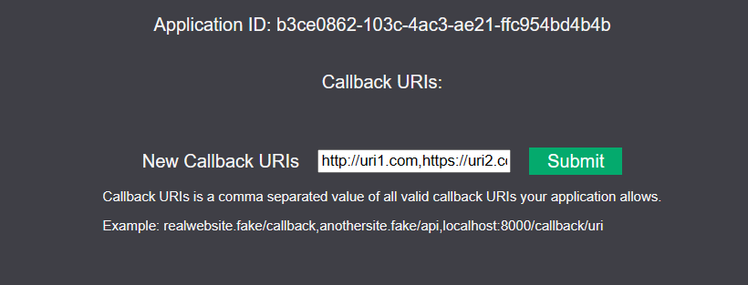

# Auth(entication)

Authentic Auth Service... Provides identification of a user from multiple external services.

Currently supported;
- Discord


# Using AbandonAuth

## Using AbandonAuth to Secure Your Application

1. Login to [AbandonAuth](https://auth.abandontech.cloud)
2. Create a Developer Application
   1. Navigate to `Developer Applications`
   2. Click `Create a new application`, then click `Create Application`
   3. Take note of/save your application token as it will never be visible again (you can reset it anytime)
3. Navigate back to `Developer Applications` and click on the recently created app's UUID to edit it then click `Edit Callback URIs`. The callback URI you specify is where AbandonAuth will redirect users after authenticating. It should be whichever address your server is using to finish handling the login process.  Some examples are as follows:
   1. For local dev you could have something like this `"http://your_computers_local_ip:8001/login/abandonauth-callback"`
      1. Or you should be able to use localhost `"http://localhost:8001/login/abandonauth-callback"`
   2. For a production website, you may use a domain name to redirect to `https://mc.abandonauth.cloud/api/callback`
   
4. Configure *your* application to use your developer application ID and secret to authenticate users from AbandonAuth.

For a quick example of how to log a user in using AbandonAuth, please see [AbandonAuth's login UI](./abandonauth/routers/ui.py)


## Local Development Guide

## First Time Install

Create your `.env` file in the root project directory, you can copy `.env.sample` as the base for this.

Read how to setup [Discord OAuth2 here.](./docs/DISCORD-OAUTH2.md)

`docker compose up --build`

A sample User schema has been created to allow the prisma client to generate upon project creation. This should be
modified or deleted to fit your app's needs prior to creating any migrations.

## Migrations
This project is using [prisma](https://www.prisma.io/) as the ORM

### Pushing migrations to the database
The migrations can be pushed to the running postgresql container using the
[schema](./prisma/schema.prisma) and migrations found in `./prisma/migrations`.

```shell
prisma db push --schema prisma/schema.prisma
```

### Creating migrations
Migrations can be created by using this command, while the database is running.

```shell
prisma migrate dev --schema prisma/schema.prisma --name "what this change does"
```

## Pre-commit
Install pre-commit to make sure you never fail linting in CI
```shell
poetry run pre-commit install
```
