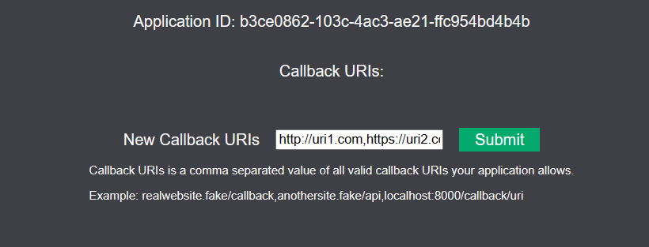

# Auth(entication)

Authentic Auth Service... Provides identification of a user from multiple external services.

Currently supported:
- Discord
- GitHub
- Google

This README has three parts, for three different jobs:

- [Integrating your application](#integrating-your-application) — you have an
  application and you want people to sign in to it with AbandonAuth.
- [Running AbandonAuth](#running-abandonauth) — you are deploying this service
  and need to know what it expects of its environment.
- [Local development](#local-development) — you are changing this repository.

# Integrating your application

You do not configure anything in this service's environment. You register a
developer application, and your own server speaks the exchange below.

## Register a developer application

1. Login to [AbandonAuth](https://auth.abandontech.cloud)
2. Create a Developer Application
   1. Navigate to `Developer Applications`
   2. Click `Create a new application`, then click `Create Application`
   3. Take note of/save your application token as it will never be visible again (you can reset it anytime)
3. Navigate back to `Developer Applications` and click on the recently created app's UUID to edit it then click `Edit Callback URIs`. The callback URI you specify is where AbandonAuth will redirect users after authenticating. It should be whichever address your server is using to finish handling the login process.  Some examples are as follows:
   1. For local dev, `http` is accepted only on the loopback interface and only with a port: `"http://localhost:8001/login/abandonauth-callback"`
   2. Everywhere else the callback must be `https`, such as `https://mc.abandonauth.cloud/api/callback`
   
4. Configure *your* application to use your developer application ID and secret to authenticate users from AbandonAuth.

## What a callback URI may be

A callback is matched exactly, so register the address you will actually be
returned to. It must be absolute, and:

- `https` anywhere; `http` only when the host is loopback, and then it must
  state a port;
- no user information, and no `#fragment`;
- it may carry a query of its own, which is preserved, but it may not already
  use the keys `code` or `authentication`, because those are what the answer is
  returned in.

You are returned to the string you registered, byte for byte: the case of the
host and the escaping of your query are left as you wrote them, and only the
one response parameter is appended. Register the spelling your server compares
against.

## The exchange

1. Send the person to the AbandonAuth login page with your `application_id` and
   your registered `callback_uri`.
2. They come back to that callback with a `code` query parameter. It is opaque,
   one-time, short-lived, and bound to your application: nobody else can spend
   it, and it works once.
3. Your **server** spends it at `POST /login`, sending the code in the
   `exchange-token` header and identifying your application in the body with its
   `id` and `refresh_token`. You get back a token for that person.
4. Call `GET /me` with that token as a `Bearer` credential to identify them.

Spend the code from your server, not from the browser: it identifies your
application with your application's own credential.

If you reset your application's credential, every token issued before the reset
stops working immediately. That is what makes a reset useful.

# Running AbandonAuth

Every setting is read from the environment. The ones that carry no secret are
also accepted as a command-line flag; the five marked **environment only** below
are not, because an argument is readable by every process on the machine. All of
them are validated once at start-up: a setting that is missing or unusable stops
the process with a message naming it, and never repeating its value.

## Settings

| Setting | Default | Required | What it is |
| --- | --- | --- | --- |
| `DATABASE_URL` | | yes | **environment only.** PostgreSQL connection URL. Scheme must be `postgres` or `postgresql` |
| `JWT_SECRET` | | yes | **environment only.** The root every signing key is derived from. **At least 64 bytes** |
| `JWT_HASHING_ALGO` | `HS512` | yes | must be exactly `HS512`; anything else fails closed rather than selecting an algorithm |
| `ABANDON_AUTH_URL` | | yes | this API's own origin, and the issuer of its tokens |
| `ABANDON_AUTH_SITE_URL` | | yes | the site's origin. The only origin allowed to call the API from a browser, and what the site's own sign-in callback is built from |
| `ABANDON_AUTH_DEVELOPER_APP_ID` | | yes | the developer application that stands for this service's own site |
| `BIND_ADDRESS` | `0.0.0.0:8000` | no | `host:port` to listen on |
| `TRUSTED_PROXY_CIDRS` | `127.0.0.1/32,::1/128` | no | whose forwarding headers are believed. **See below** |
| `ABANDON_AUTH_API_ADDRESS` | `ABANDON_AUTH_URL` | no | where the site's own server dials the API. **See below** |
| `API_PORT`, `WEBSITE_PORT` | `8000`, `3000` | no | the host ports `compose.yml` publishes the two services on |
| `API_BUILD_TARGET` | `deployment` | no | which of the two API builds `compose.yml` builds |
| `JWT_EXPIRES_IN_SECONDS_SHORT_LIVED` | `120` | no | one-time code lifetime. Capped at 120 seconds |
| `JWT_EXPIRES_IN_SECONDS_LONG_LIVED` | `2592000` | no | browser session lifetime. Capped at 30 days |
| `DEBUG` | `false` | no | development build only; the published image refuses to start with it set |
| `DISCORD_CLIENT_ID`, `DISCORD_CLIENT_SECRET`, `ABANDON_AUTH_DISCORD_CALLBACK` | | yes | see [Discord](./docs/DISCORD-OAUTH2.md) |
| `GITHUB_CLIENT_ID`, `GITHUB_CLIENT_SECRET`, `ABANDON_AUTH_GITHUB_CALLBACK` | | yes | see [GitHub](./docs/GITHUB-OAUTH2.md) |
| `GOOGLE_CLIENT_ID`, `GOOGLE_CLIENT_SECRET`, `GOOGLE_CALLBACK` | | yes | see [Google](./docs/GOOGLE-OAUTH2.md) |

Each `_CLIENT_SECRET` is environment only, alongside `DATABASE_URL` and
`JWT_SECRET`. Passing one of the five as a flag is an unknown-flag error.

All three provider registrations are required. There is no way to run with two
of them.

`ABANDON_AUTH_URL` and `ABANDON_AUTH_SITE_URL` are parsed as origins, not as
general URLs: scheme, host and an optional port only — no path beyond `/`, no
query, no fragment, no user information. Outside a loopback development build
both must be `https`.

`ABANDON_AUTH_DEVELOPER_APP_ID` decides which logins produce a browser session
rather than a one-time code, so it must name this deployment's own site
application and nothing else.

The site serves the API to a browser at `/api` and forwards those calls itself.
`ABANDON_AUTH_URL` is the origin the browser and the registered callback URIs
use, and it does not resolve to the API from inside the stack, so
`ABANDON_AUTH_API_ADDRESS` is where the site's own server dials instead —
`http://abandonauth:8000` on the compose network. The `/api` prefix is this
site's, and is removed before the call is made: the API answers at `/me`.

## The signing secret

Provision at least 64 random bytes from a secret manager. Replacing it
invalidates every credential this service has issued, so after changing it run:

```shell
abandonauth database rotate-auth-epoch
```

That withdraws every access token, login in progress, one-time code and browser
session in one transaction. Run it during a maintenance window; everyone signs
in again afterwards.

## Behind a reverse proxy

**This is the one thing the service genuinely requires of its environment.**

Request budgets are counted per client address. A forwarding header
(`X-Forwarded-For`, `X-Real-IP`) is believed **only** when the connection itself
came from an address inside `TRUSTED_PROXY_CIDRS`. Anywhere else it is ignored,
because anyone can send one, and believing it would let a single client present
a new identity per request and never be limited.

The default, `127.0.0.1/32,::1/128`, is right when nothing is in front of the
service, and when the proxy is a sidecar sharing the loopback interface.

The site is one of the things in front of it: it forwards the browser's `/api`
calls from its own container, so on the compose network those arrive from a
container address the default does not cover. Until an operator names that
range, every browser reaching the API through the site counts against one
address. Do not reach for a broad range such as `172.16.0.0/12` to fix it:
requests arriving on the published port are translated by Docker and can
present a bridge address too, which would let anyone reaching `localhost:8000`
directly choose the address they are counted as.

If the proxy is **anywhere else** — another container, a Kubernetes ingress, a
load balancer, or a CDN terminating at your origin — set
`TRUSTED_PROXY_CIDRS` to the ranges it connects from:

```dotenv
TRUSTED_PROXY_CIDRS=10.0.0.0/8,172.16.0.0/12
```

Leaving the default in that situation is not a security problem but is an
availability one: every request collapses onto the proxy's single address, so
one busy client exhausts a budget shared by everybody.

Trusting too much is the dangerous direction. `0.0.0.0/0` makes the header
client-controlled, which disables rate limiting entirely. List only the ranges
your proxy actually connects from, and make sure that proxy sets
`X-Forwarded-For` itself rather than passing through whatever it received.

Nothing else about the service is proxy-dependent: it needs no particular
provider or vendor, and no other header.

## The published image

The image built from `src/api/Dockerfile` (the `deployment` target) contains no
password sign-in, refuses to start with `DEBUG` set, runs as an account that is
not root, and holds nothing but the binary and a certificate bundle. Migrations
travel inside the binary, so no schema file is deployed alongside it.

This is a public API, so the documentation and the schema are in that image and
are served at `/docs` and `/openapi.json` whatever the configuration.

`compose.yml` builds that target unless `API_BUILD_TARGET` names the other one.
Deploy with:

```shell
docker compose up --build -d
```

It reads `.env` from the repository root and will not start without it. The
database publishes no host port and is on a network of its own, which the site
does not join, so it is reachable at `database:5432` from the API and from
nowhere else.

The same image started with `abandonauth maintenance` answers every request with
a 503 and `Retry-After`. It opens no database connection and reads no setting
but the address, so it still starts when the reason for a failure is the
configuration itself.

## The database this service will accept

`abandonauth serve` applies outstanding migrations before it accepts a request,
and it does so only against a database it can prove it built: an empty one, or
one carrying both its own migration history and the marker its baseline writes.
Account tables without that pair, a partial set of them, a history with a gap or
a version this binary does not carry, and a migration recorded as unfinished are
each refused with the database left exactly as it was found.

Start a deployment against a genuinely empty database. Do not delete or replace
a volume to get past a refusal; a refused database is preserved so you can look
at it. The only backups this service can be recovered from are backups of a
database it migrated itself.

To recover: serve `abandonauth maintenance`, restore such a backup, check the
migration version, start the deployment image again, and run
`abandonauth database rotate-auth-epoch` whenever the signing secret changed or
credential authority may have crossed the restore point.

# Local Development

## Prerequisites

| Needed for | Install |
| --- | --- |
| Everything | [Docker](https://docs.docker.com/get-docker/) |
| The API checks on your own machine | [Go](https://go.dev/dl/) |
| The site's tests and build | [Node](https://nodejs.org/) 24 |
| The commit hooks | [pre-commit](https://pre-commit.com/#install) |

`src/api/go.mod` asks for Go 1.27, and `GOTOOLCHAIN` defaults to `auto`, so a
newer toolchain is fetched for you if the one you have is older. Nothing here
needs a C compiler: the checks that do, the race detector among them, run inside
a container.

## First time install

Create your `.env` in the root of the project; copy `.env.sample` as the base.
It carries every setting the API reads, with placeholders. Fill in the provider
registrations:

- [Discord](./docs/DISCORD-OAUTH2.md)
- [GitHub](./docs/GITHUB-OAUTH2.md)
- [Google](./docs/GOOGLE-OAUTH2.md)

Then:

```shell
docker compose up --build
```

One file, for development and for production alike; `.env` is the only thing
that differs between them. `API_BUILD_TARGET=development` in the sample selects
the API build carrying password sign-in, which also needs `DEBUG=true`; the
`deployment` build refuses to start with `DEBUG` set at all.

The site is on `WEBSITE_PORT` and the API on `API_PORT`, 3000 and 8000 in the
sample. Reach the API through the site, at `/api`: that is the origin the
sign-in cookies belong to, and a provider that returns a browser straight to
port 8000 sends none of them.

The documentation is at <http://localhost:3000/api/docs>, and is served by
every build.

Password sign-in additionally requires a listener no other machine can reach,
which a container publishing a port does not have. To use `/create_test_user`
and `/login_test_user`, run the API directly with `BIND_ADDRESS=127.0.0.1:8000`
instead.

## Checks

One script, and CI runs the same one, so the two cannot drift.

```shell
./scripts/check.sh                # codegen, formatting, lint, build, unit tests
./scripts/check.sh --quick        # the same, skipping codegen and go mod tidy
./scripts/check.sh --fix-fmt      # format the source, then check
./scripts/check.sh --integration  # also the race, database and coverage checks
./scripts/db.sh down              # remove the test database when you are done

npm --prefix src/website test
npm --prefix src/website run build
```

On Windows run them through Git Bash —
`& "C:\Program Files\Git\bin\bash.exe" scripts/check.sh` — rather than invoking
the `.sh` file from PowerShell, which opens the application chooser.

`--integration` needs Docker; the rest runs on your machine.
`./scripts/check.sh` reports formatting rather than correcting it, so that a
check never rewrites your work; `--fix-fmt` is how you correct it.

Every package is held to 80% statement coverage by `--integration`. The sqlc and
Swagger output is generated on every run and is not committed. Never edit it.

## Migrations

The schema is `.sql` files under
[`src/api/internal/database/migrations/`](./src/api/internal/database/migrations),
run by [goose](https://github.com/pressly/goose). They are compiled into the
binary, so a deployment needs no schema file alongside it.

`abandonauth serve` applies anything outstanding before it accepts a request, so
starting the stack migrates a development database for you.

To add one, write a new file named `<UTC timestamp>_<what it does>.sql` with
`-- +goose Up` and `-- +goose Down` sections. Down is for tests only; a
deployment never runs it. Queries live in
[`src/api/internal/database/queries/`](./src/api/internal/database/queries) and
`sqlc` turns them into Go on the next check.

## Pre-commit

Install the hooks so you never fail linting in CI:

```shell
pre-commit install
```
