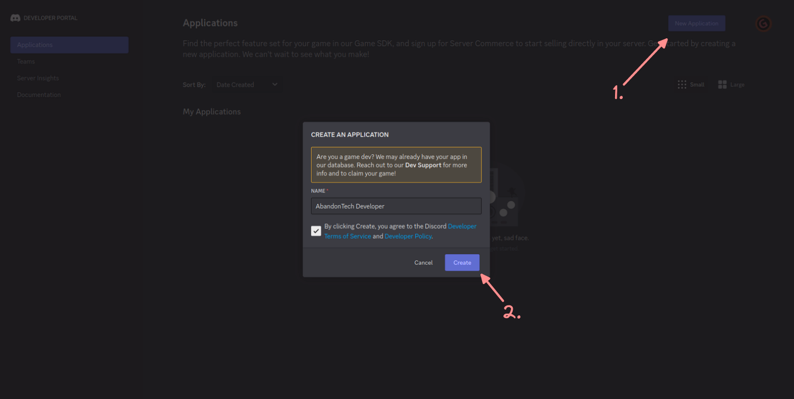
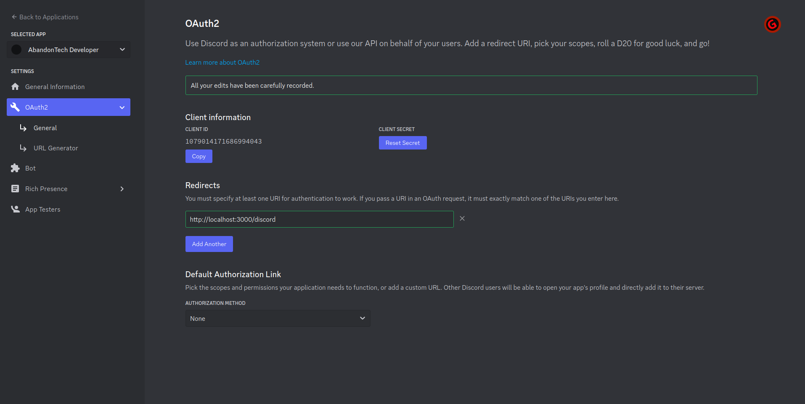
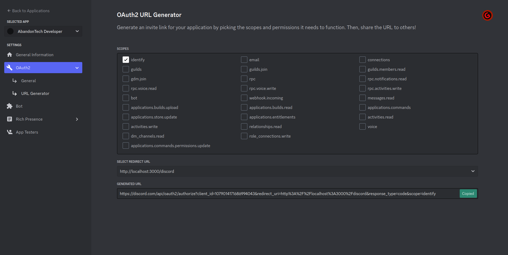

# Discord OAuth2 Setup

###  1. Goto [Discord Developer Portal - Applications](https://discord.com/developers/applications)

### 2. Create a New Application


### 3. Add Redirect in OAuth2 tab
Note: Every time you wish to see your client secret, you must regenerate it.


### 4. Create Redirect Url


### 5. Fill `.env` file

```dotenv
# Discord Application Details for OAuth2
DISCORD_CLIENT_ID=<Client ID in step 3>
DISCORD_CLIENT_SECRET=<Client Secret in step 3>
DISCORD_CALLBACK=http://localhost:8000
```
