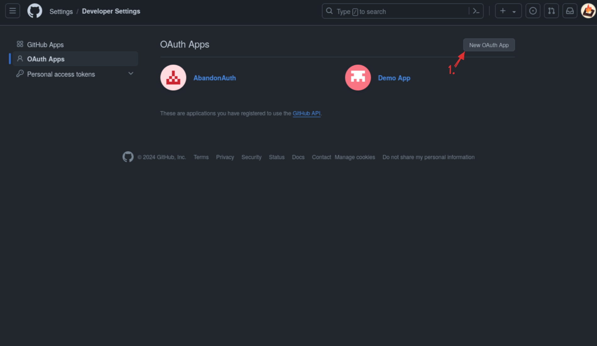
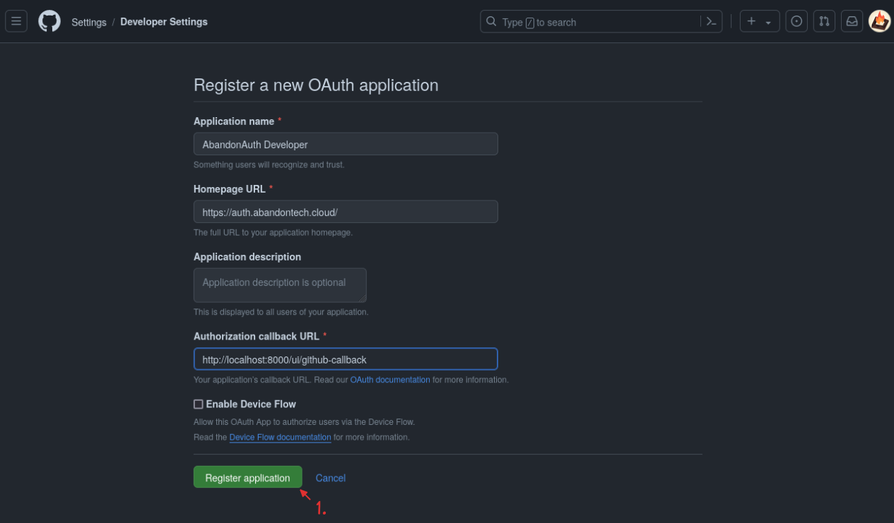
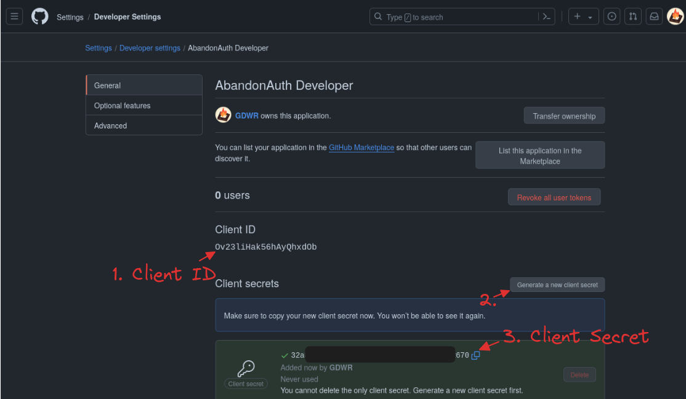

# GitHub OAuth2 Setup

###  1. Goto [GitHub Developer Apps](https://github.com/settings/developers)

### 2. Create a New Application


### 3. Add details


### 4. Get Client ID and Secrets


### 5. Fill `.env` file

```dotenv
# GitHub Application Details for OAuth2
GITHUB_CLIENT_ID=<Client ID in step 4>
GITHUB_CLIENT_SECRET=<Client Secret in step 4>
ABANDON_AUTH_GITHUB_CALLBACK='http://localhost:8000/ui/github-callback'
ABANDON_AUTH_GITHUB_REDIRECT="https://github.com/login/oauth/authorize?client_id=$GITHUB_CLIENT_ID&redirect_uri=$ABANDON_AUTH_GITHUB_CALLBACK&scope=user:email"
```
