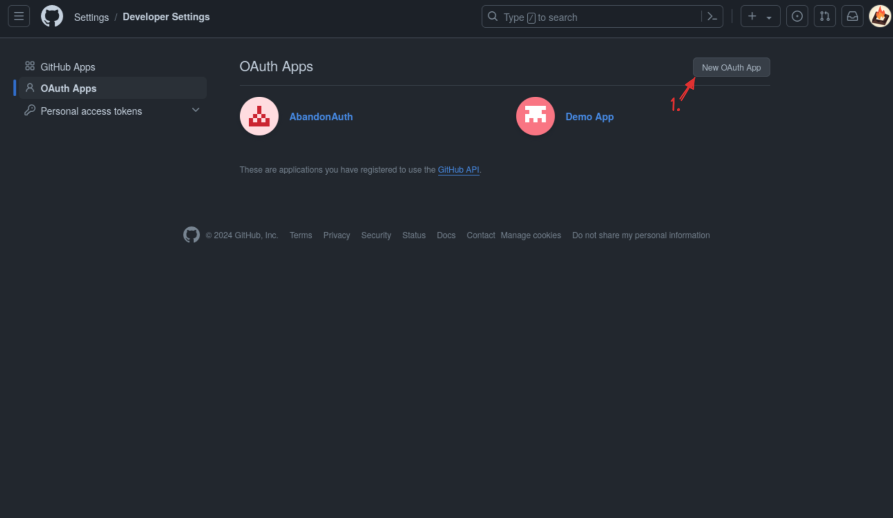
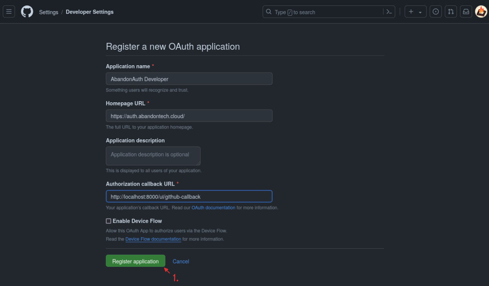
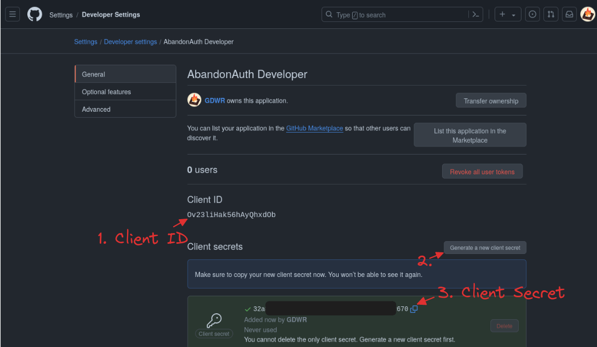

# GitHub OAuth2 Setup

###  1. Goto [GitHub Developer Apps](https://github.com/settings/developers)

### 2. Create a New Application


### 3. Add details


### 4. Get Client ID and Secrets


### 5. Fill `.env` file

```dotenv
# GitHub Application Details for OAuth2
GITHUB_CLIENT_ID=<Client ID in step 4>
GITHUB_CLIENT_SECRET=<Client Secret in step 4>
ABANDON_AUTH_GITHUB_CALLBACK=http://localhost:3000/api/ui/github-callback
```

Register that same address with GitHub in step 3, exactly. A sign-in starts at
the site on port 3000, which is where the cookie binding the attempt to your
browser is set, so a redirect back to the API's own port carries no such cookie
and the login cannot be matched to one that was started.

There is no setting holding a provider's authorization URL. The API builds it
from the client ID and callback above, so that the address, the scopes and the
per-attempt state are decided in one place.
